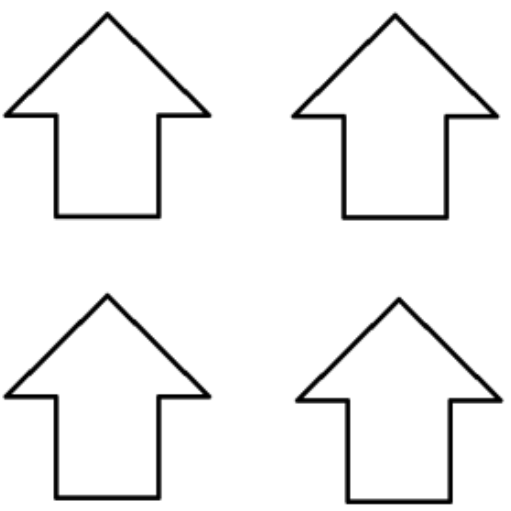

# Jogo dos Ponteiros
Repositório criado como sugestão de modelagem do problema Jogo dos Ponteiros, criado por Seyyed Shahdad Dana, utilizando os recursos do repositório aima-python.

O problema foi apresentado na disciplina de Inteligência Artificial, ministrada pelo Prof. Dr. Carlos Alberto Estombelo Montesco.
## Descrição do problema
O objetivo do jogo é fazer todas as setas de um tabuleiro 2x2 apontarem para a mesma direção, como ilustrado abaixo.

### Funcionamento interno
Dentro do tabuleiro, existem quatro blocos, cada um com seu ponteiro.

No início de cada simulação, o ambiente determina a direção de cada ponteiro aleatoriamente.

Um ponteiro pode receber quatro direções: esquerda, direita, para cima e para baixo.

Também no início da simulação, é dada aleatoriamente a posição inicial do agente.

A cada rodada, o agente pode realizar somente uma das seguintes ações: deslocar-se pelo tabuleiro (mover) ou girar um ponteiro (girar).

Ambas são ações unitárias, ou seja, um ponteiro que está direcionado para cima não pode ser redirecionado para baixo de imediato, são necessárias duas ações para tal.

### Escopo de ações
**Mover:** Cima, Baixo, Esquerda, Direita

**Girar:** Horário, Antihorário

## Descrição da Solução
No arquivo, jogo_dos_ponteiros.py, está modelada a classe JogoPonteiros, que herda os métodos da classe Problem, do AIMA.

A classe Problem segue as características de um problema definidas no AIMA. São elas:

- Estado inicial definido;
- Conjunto de ações possíveis a partir de um estado;
- Teste de verificação do estado objetivo;
- Custo.

Para o problema JogoPonteiros, cada característica foi implementada da seguinte forma:

- Estado inicial: vetor de tamanho 4 armazenando inteiros de 0 a 3 gerados aleatoriamente, simulando uma rotação em sentido horário.

    [0: esquerda, 1: cima, 2: direita, 3: baixo]
- Ações possíveis: vetor contendo as ações descritas no escopo, excluindo ações "impossíveis", como ir para a direita na coluna da direita, ou ir para cima na linha superior;
- Teste de objetivo: função de comparação do estado atual com o estado objetivo, este é gerado considerando a posição da seta que mais se repete no tabuleiro;
- Custo: como cada ação é unitária, seu custo é constante.

Além disso, para maior adaptação entre as implementações dos algoritmos de busca, foi definida uma função heurística. Nesse caso, a heurística adotada estima o custo do número de ações necessárias para que uma seta chegue à posição definida no estado final.

### Arquivos principais
A estruturação para o problema foi declarada na classe JogoPonteiros do arquivo jogo_dos_ponteiros.py
A função principal, ou execução da solução, foi declarada no arquivo main.py. Nele, o algoritmo de busca pode ser alterado por qualquer outro algoritmo implementado no arquivo search.py
